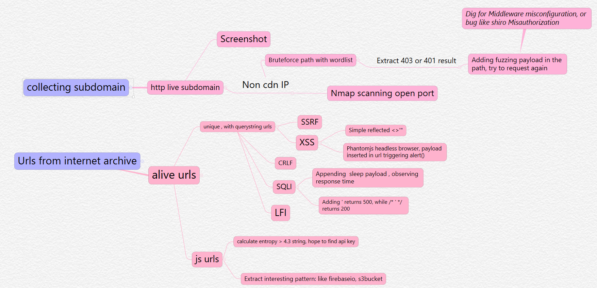

# Allinone


☀️**The purpose of this tool is to intergrate lots of awesome tools and creative ideas and build a recon and vulnerablity scanning pipeline, so you only need to press an enter, instead of  siting on the chair waiting results from one tool and then input them to another. There are lots of bash scripts for this, but bash scripts is hard to scale and maintain.**


## 📝 Install instruments

This tool requires the newest python version`3.9.6`  , the tool will fail on `3.9.2`  since there is a bug in `3.9.2`   related to false positve in circular import detection https://bugs.python.org/issue43517 .


```bash
git clone https://github.com/ThoundsN/AllinOne.git
cd AllinOne 
pip3 install -r requirements.txt
./setup.sh
touch .env
```

And then you need to create an .env file with contents like this

```
root_data_dir=/root/docker-nginx-php-mysql/web/public/data     # your data storage path
collaborator=https://collaborator.buzz/webhook.php      # Collaborator for ssrf ping back 
```

If you need to use the get parameter ssrf scanning feature,  you need to set up a listening server, you can use

https://github.com/nanoninja/docker-nginx-php-mysql

https://gist.github.com/ThoundsN/76a9481f104968469d4c1c862c291fc0

or you can set up a private burpcollaborator https://portswigger.net/burp/documentation/collaborator/deploying


Finally, you can check whether all the depending third party software is executable on your machine

```
python3 allinone.py  check
```

 This checking script simply invoke command with -h or --help and check exit code, if you find there are some  warnings about a command, you should manually check it.

**Note**:  For debian , if there are errors about `phantomjs` , you might want to check this https://bugs.debian.org/cgi-bin/bugreport.cgi?bug=817277


## 🎬 Usage guide 

```
python3 allinone.py  --domain=example.com  run
--verbose=stdout   # doesn't filter stdout,stderr of invoked thirdparty 
--verbose=log    #   stdout,stderr of invoked thirdparty > logfile  


```


It's recommend to put the result folder after autoindex enabled nginx web directory , so it will be possible to view the result from a browser.


## ⚓ Code/Feature flow 

- Feature  mindmap



## 👑Credits of third party tool 

https://github.com/shmilylty/OneForAll

https://github.com/gwen001/pentest-tools

https://github.com/securing/DumpsterDiver

https://github.com/maaaaz/webscreenshot

https://github.com/ffuf/ffuf

https://github.com/ameenmaali/urldedupe

https://github.com/lc/gau

https://github.com/ameenmaali/qsfuzz

https://github.com/aria2/aria2

https://github.com/projectdiscovery/httpx

https://github.com/tomnomnom/hacks/tree/master/kxss

https://github.com/blechschmidt/massdns


## 🎸To do   

adding crawler 

adding h2csmuggler 

